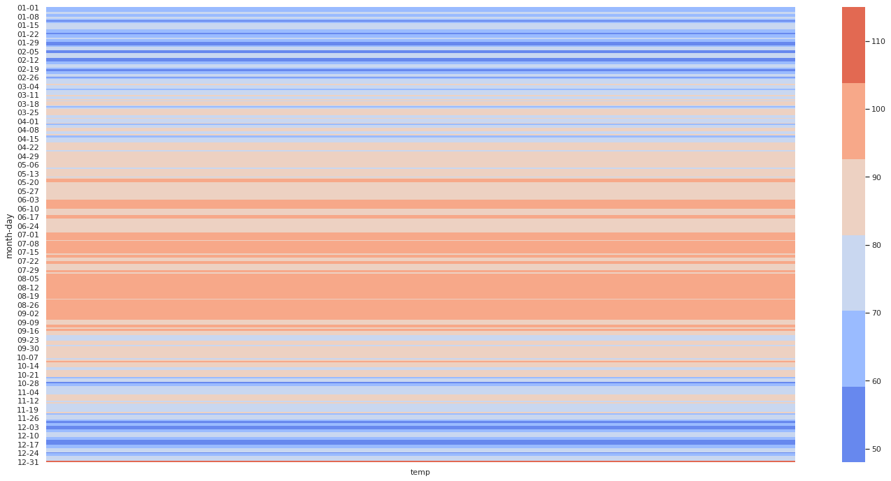

# Calendar Heatmap

This whole repository has gathered some dust and remains a massive work-in-progress, but the idea of it all is to take some region (Houston, Texas for example) and create a graph which shows the temperature throughout the year. Its prototype is completed for the most part, but the color of the graphs need to be standardized so that created graphs may be compared to one another meaningfully. As of right now, the color scale will change from region-to-region depending on their average temperatures, which isn't *too* helpful!

The repository currently implements an ad-hoc approach that tries a hard-coding of the low and high temperatures. This obviously isn't optimal, but the notebooks will work for single regions at a time. The graph below is an example of Houston's weather for 2020.

 

## Things to Do

This repository still needs a lot of love. In addition to it needing a standardization for the colors in the graph, it would greatly benefit from a few dropdown menus which allow the user to select the region to plot and for what year. This would require a change from `seaborn` to `plotly`, preferably with Dash.
